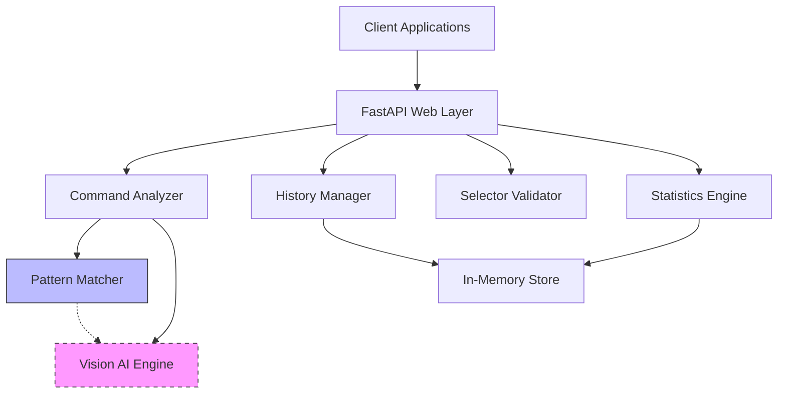

# Design Document: Web Automation API

## Overview

The Sahayak Automation API is a FastAPI-based microservice that bridges the gap between human intent and web automation. The system accepts natural language commands paired with screenshots and translates them into precise automation actions. The current implementation uses pattern matching for command analysis, with a clear migration path to Vision AI integration.

The system follows a stateless request-response pattern for the core automation functionality while maintaining optional in-memory state for history tracking and analytics. This design ensures scalability while providing useful debugging and monitoring capabilities.

## Architecture

The system follows a layered architecture with clear separation of concerns:



**Layer Responsibilities:**
- **Web Layer**: HTTP request handling, CORS, error management, data validation
- **Command Analyzer**: Core logic for interpreting user commands and screenshots
- **History Manager**: Action tracking, storage, and retrieval with size limits
- **Selector Validator**: CSS selector syntax validation and error reporting
- **Statistics Engine**: Usage analytics and performance metrics calculation

## Components and Interfaces

### Core Components

#### 1. Command Analyzer
**Purpose**: Analyzes user commands and screenshots to determine automation actions

**Interface**:
```python
class CommandAnalyzer:
    def analyze(self, command: str, screenshot: str, url: Optional[str]) -> ActionResponse:
        """Analyzes command and screenshot to determine automation action"""
        pass
    
    def set_confidence_threshold(self, threshold: float) -> None:
        """Sets minimum confidence threshold for actions"""
        pass
```

**Current Implementation**: Pattern-based matching with keyword detection
**Future Implementation**: Vision AI integration with Claude/GPT-4V

#### 2. Pattern Matcher
**Purpose**: Current rule-based command analysis engine

**Interface**:
```python
class PatternMatcher:
    def match_name_field(self, command: str) -> Optional[ActionMatch]:
        """Matches name field input commands"""
        pass
    
    def match_email_field(self, command: str) -> Optional[ActionMatch]:
        """Matches email field input commands"""
        pass
    
    def match_phone_field(self, command: str) -> Optional[ActionMatch]:
        """Matches phone field input commands"""
        pass
    
    def match_submit_action(self, command: str) -> Optional[ActionMatch]:
        """Matches submit/next button commands"""
        pass
    
    def match_click_action(self, command: str) -> Optional[ActionMatch]:
        """Matches generic click commands"""
        pass
    
    def match_scroll_action(self, command: str) -> Optional[ActionMatch]:
        """Matches scroll commands"""
        pass
    
    def match_wait_action(self, command: str) -> Optional[ActionMatch]:
        """Matches wait commands"""
        pass
    
    def extract_value(self, command: str, keyword: str) -> str:
        """Extracts custom values from commands using 'with' keyword"""
        pass
```

#### 3. History Manager
**Purpose**: Manages action history with size limits and retrieval

**Interface**:
```python
class HistoryManager:
    def add_action(self, record: ActionRecord) -> None:
        """Adds action to history with automatic size management"""
        pass
    
    def get_history(self, limit: int = 20) -> HistoryResponse:
        """Retrieves recent actions in reverse chronological order"""
        pass
    
    def clear_history(self) -> None:
        """Removes all stored action records"""
        pass
    
    def get_total_count(self) -> int:
        """Returns total number of actions in history"""
        pass
```

#### 4. Selector Validator
**Purpose**: Validates CSS selector syntax for automation reliability

**Interface**:
```python
class SelectorValidator:
    def validate(self, selector: str) -> ValidationResult:
        """Validates CSS selector syntax and returns detailed result"""
        pass
    
    def check_brackets(self, selector: str) -> bool:
        """Checks for balanced brackets in selector"""
        pass
    
    def check_parentheses(self, selector: str) -> bool:
        """Checks for balanced parentheses in selector"""
        pass
```

#### 5. Statistics Engine
**Purpose**: Calculates usage analytics and performance metrics

**Interface**:
```python
class StatisticsEngine:
    def calculate_stats(self, history: List[ActionRecord]) -> StatsResponse:
        """Calculates comprehensive usage statistics"""
        pass
    
    def get_action_distribution(self, history: List[ActionRecord]) -> Dict[str, int]:
        """Returns distribution of action types"""
        pass
    
    def calculate_success_rate(self, history: List[ActionRecord]) -> float:
        """Calculates percentage of successful actions"""
        pass
    
    def find_most_common_command(self, history: List[ActionRecord]) -> Optional[str]:
        """Identifies most frequently used command"""
        pass
```

### Data Models

#### Request Models
```python
class AnalyzeRequest(BaseModel):
    user_command: str  # Natural language instruction
    screenshot: str    # Base64-encoded image
    url: Optional[str] = None  # Current page URL for context

class ValidationRequest(BaseModel):
    selector: str  # CSS selector to validate
```

#### Response Models
```python
class ActionResponse(BaseModel):
    action: str        # Action type: type, click, scroll, wait, none
    selector: str      # CSS selector for target element
    value: str         # Value for input actions or direction for scroll
    confidence: float  # Confidence score (0.0-1.0)
    timestamp: str     # ISO format timestamp
    explanation: str   # Human-readable explanation

class HistoryResponse(BaseModel):
    total: int                    # Total number of actions in history
    actions: List[ActionRecord]   # List of action records

class ActionRecord(BaseModel):
    command: str           # Original user command
    url: Optional[str]     # Page URL when action was performed
    response: ActionResponse  # Generated action response
    timestamp: str         # ISO format timestamp

class ValidationResult(BaseModel):
    valid: bool           # Whether selector is valid
    selector: str         # Original selector (if valid)
    error: Optional[str]  # Error message (if invalid)

class StatsResponse(BaseModel):
    total_actions: int                # Total number of actions performed
    action_types: Dict[str, int]      # Distribution of action types
    success_rate: float               # Percentage of non-"none" actions
    most_common_command: Optional[str] # Most frequently used command

class HealthResponse(BaseModel):
    status: str           # System status
    service: str          # Service name
    version: str          # API version
    timestamp: str        # Current timestamp
    actions_in_history: int  # Current history count
```

### API Endpoints

#### Core Automation Endpoint
- **POST /analyze**: Main automation endpoint
  - Input: AnalyzeRequest (command + screenshot)
  - Output: ActionResponse (action details)
  - Processing: Command analysis → Action generation → History storage

#### History Management Endpoints
- **GET /history**: Retrieve action history
  - Parameters: limit (optional, default 20)
  - Output: HistoryResponse (paginated history)
  - Processing: History retrieval → Reverse chronological ordering

- **DELETE /history**: Clear action history
  - Output: Success confirmation
  - Processing: Memory cleanup → Confirmation response

#### Utility Endpoints
- **POST /validate**: CSS selector validation
  - Input: selector string
  - Output: ValidationResult
  - Processing: Syntax checking → Error reporting

- **GET /stats**: Usage statistics
  - Output: StatsResponse
  - Processing: History analysis → Statistics calculation

- **GET /health**: System health check
  - Output: HealthResponse
  - Processing: System status → Detailed health information

- **GET /**: API information
  - Output: Service information and endpoint documentation
  - Processing: Static information assembly

## Correctness Properties

*A property is a characteristic or behavior that should hold true across all valid executions of a system—essentially, a formal statement about what the system should do. Properties serve as the bridge between human-readable specifications and machine-verifiable correctness guarantees.*

### Property 1: Command Analysis Completeness
*For any* user command and screenshot input, the analyze endpoint should return a complete ActionResponse with all required fields (action, selector, value, confidence, timestamp, explanation) properly populated and within valid ranges.
**Validates: Requirements 1.1, 7.2, 7.5, 7.6**

### Property 2: Pattern Matching Consistency
*For any* command containing recognized keywords ("name", "email", "phone", "submit", "click", "scroll", "wait"), the system should generate the appropriate action type with field-specific CSS selectors that match the command intent.
**Validates: Requirements 1.2, 1.3, 1.4, 1.5, 1.6, 1.7, 1.8**

### Property 3: Value Extraction Accuracy
*For any* command containing "with [value]" pattern, the system should extract and use the specified value in the generated action, preserving the original value without modification.
**Validates: Requirements 1.9**

### Property 4: Fallback Behavior
*For any* command that doesn't match known patterns, the system should return an action with type "none" and provide a meaningful explanation for the non-recognition.
**Validates: Requirements 1.10**

### Property 5: History Storage Completeness
*For any* automation action generated, the system should store a complete action record in history containing the original command, URL, response details, and timestamp in ISO format.
**Validates: Requirements 2.1, 2.2**

### Property 6: History Size Management
*For any* sequence of actions that would exceed 100 records, the system should maintain exactly 100 records by removing the oldest entries while preserving the most recent actions.
**Validates: Requirements 2.3, 9.2, 10.5**

### Property 7: History Ordering and Pagination
*For any* history retrieval request with a specified limit, the system should return exactly that number of records (or fewer if insufficient history exists) in reverse chronological order with the most recent actions first.
**Validates: Requirements 2.4, 2.5**

### Property 8: History Management Operations
*For any* history clearing operation, the system should remove all stored records and return a success confirmation, leaving the history empty for subsequent requests.
**Validates: Requirements 2.6, 2.7**

### Property 9: CSS Selector Validation
*For any* CSS selector string, the validation endpoint should correctly identify syntax errors (mismatched brackets, parentheses, empty selectors) and return appropriate error messages or validation success.
**Validates: Requirements 3.1, 3.2, 3.3, 3.5, 3.6**

### Property 10: Statistics Calculation Accuracy
*For any* action history state, the statistics endpoint should calculate correct totals, action type distributions, success rates (percentage of non-"none" actions), and identify the most frequently used command.
**Validates: Requirements 4.1, 4.2, 4.3, 4.4, 4.6**

### Property 11: API Contract Compliance
*For any* valid request to each endpoint, the system should accept the expected input format and return the specified response model with all required fields properly typed and formatted.
**Validates: Requirements 6.4, 6.5, 6.6, 6.7, 6.8, 6.9, 7.1, 7.3, 7.4, 7.7**

### Property 12: Error Handling Safety
*For any* exception or error condition, the system should return structured error responses without exposing sensitive system information or internal implementation details.
**Validates: Requirements 6.2, 6.3, 10.3**

### Property 13: Data Privacy Protection
*For any* user command containing personal information, the system should process the data without persisting sensitive details in logs or permanent storage, and screenshots should not be stored beyond request processing.
**Validates: Requirements 10.1, 10.4**

## Error Handling

The system implements comprehensive error handling at multiple layers:

### HTTP Layer Error Handling
- **HTTP Exceptions**: Structured responses with appropriate status codes
- **General Exceptions**: Safe error messages without system details exposure
- **Request Validation**: Pydantic model validation with detailed error messages
- **CORS Handling**: Proper cross-origin request management

### Business Logic Error Handling
- **Pattern Matching Failures**: Graceful fallback to "none" action with explanation
- **Screenshot Processing Errors**: Safe handling of malformed base64 data
- **History Overflow**: Automatic oldest record removal without errors
- **Validation Errors**: Detailed syntax error reporting for CSS selectors

### Data Integrity Error Handling
- **Timestamp Generation**: Consistent ISO format with timezone handling
- **Confidence Score Bounds**: Automatic clamping to 0.0-1.0 range
- **Memory Management**: Automatic cleanup to prevent memory leaks
- **Concurrent Access**: Thread-safe operations for shared data structures

## Testing Strategy

The system requires a dual testing approach combining unit tests for specific scenarios and property-based tests for comprehensive coverage:

### Unit Testing Focus
- **Specific Examples**: Test concrete command patterns with known expected outputs
- **Edge Cases**: Empty selectors, malformed base64 data, boundary conditions
- **Error Conditions**: Invalid requests, exception scenarios, malformed data
- **Integration Points**: API endpoint contracts, middleware behavior, error handlers

### Property-Based Testing Configuration
- **Testing Library**: Use Hypothesis for Python property-based testing
- **Test Iterations**: Minimum 100 iterations per property test for statistical confidence
- **Data Generation**: Custom generators for commands, selectors, base64 images, timestamps
- **Property Tagging**: Each test tagged with format: **Feature: web-automation-api, Property {number}: {property_text}**

### Test Data Generators
```python
# Command generators for different patterns
@composite
def name_commands(draw):
    """Generates commands with name field patterns"""
    base_commands = ["fill name", "enter naam", "type name"]
    command = draw(sampled_from(base_commands))
    if draw(booleans()):
        value = draw(text(min_size=1, max_size=50))
        command += f" with {value}"
    return command

@composite
def css_selectors(draw):
    """Generates valid and invalid CSS selectors"""
    # Mix of valid selectors and intentionally broken ones
    pass

@composite
def base64_images(draw):
    """Generates valid base64 encoded image data"""
    # Generate small test images in base64 format
    pass
```

### Coverage Requirements
- **Unit Tests**: Focus on specific examples and error conditions
- **Property Tests**: Verify universal properties across all valid inputs
- **Integration Tests**: End-to-end API behavior validation
- **Performance Tests**: Response time validation for pattern matching operations

The combination ensures both concrete correctness validation and comprehensive input space coverage, providing confidence in system reliability across all usage scenarios.